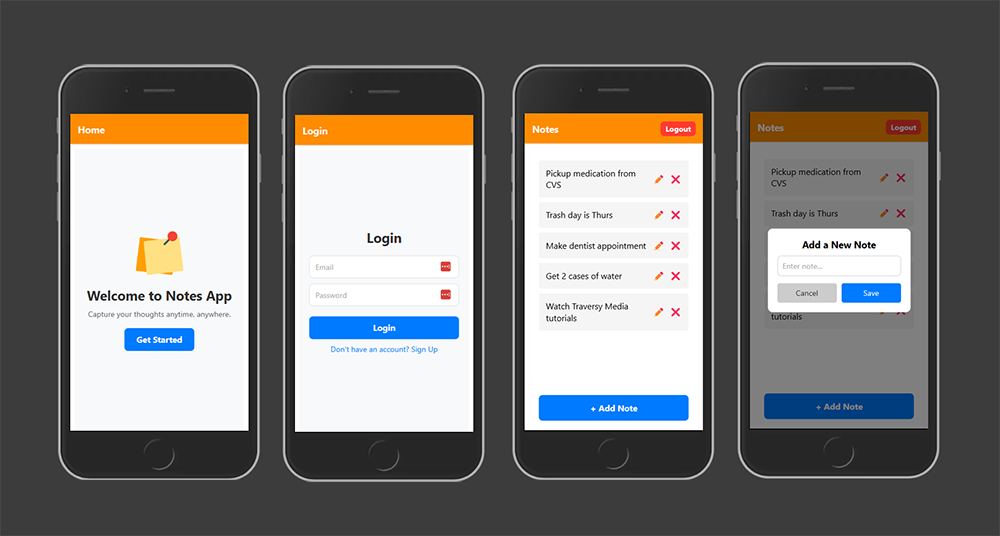

# 📝 Notes App

A full-featured cross-platform notes application built with React Native and Expo, allowing users to create, read, update, and delete notes with Appwrite as the backend.



## ✨ Features

- **User Authentication** - Sign up, sign in, and sign out functionality
- **Create Notes** - Add new notes with titles and descriptions
- **Update Notes** - Edit existing notes
- **Delete Notes** - Remove unwanted notes
- **Private Notes** - Notes are private to authenticated users
- **Cross-Platform** - Works on iOS, Android, and Web

## 📱 Screenshots

<div style="display: flex; flex-wrap: wrap; gap: 10px; justify-content: center;">
  <!-- Replace these with your actual screenshots -->
  
  
  
  
</div>

## 🚀 Getting Started

### Prerequisites

- [Node.js](https://nodejs.org/) (v14 or newer)
- [npm](https://www.npmjs.com/) or [yarn](https://yarnpkg.com/)
- [Expo CLI](https://docs.expo.dev/workflow/expo-cli/)
- [Appwrite Account](https://appwrite.io/)

### Installation

1. Clone the repository:
   ```bash
   git clone https://github.com/yourusername/notes-app.git
   cd notes-app
   ```

2. Install dependencies:
   ```bash
   npm install
   # or
   yarn install
   ```

3. Set up environment variables:
   - Rename `.env.example` to `.env`
   - Fill in your Appwrite project details:
     ```
     APPWRITE_ENDPOINT=https://cloud.appwrite.io/v1
     APPWRITE_PROJECT_ID=your-project-id
     APPWRITE_DATABASE_ID=your-database-id
     APPWRITE_COLLECTION_ID=your-collection-id
     ```

### Setting up Appwrite

1. [Sign up for Appwrite](https://apwr.dev/traversyfeb2025)
2. Create a new project
3. Create a new database
4. Create a new collection for notes with the following attributes:
   - `title` (string)
   - `content` (string)
   - `userId` (string)
   - `createdAt` (datetime)
   - `updatedAt` (datetime)
5. Set up authentication methods (email/password)
6. Update your `.env` file with the appropriate IDs

## 🏃‍♂️ Running the App

Start the development server:

```bash
npm start
# or
yarn start
```

You can then run the app:

- **iOS Simulator**: Press `i` in the terminal or `npm run ios`
- **Android Emulator**: Press `a` in the terminal or `npm run android`
- **Web Browser**: Press `w` in the terminal or `npm run web`
- **Physical Device**: Scan the QR code with the Expo Go app

## 📦 Building for Production

### Using Expo Application Services (EAS)

1. Install EAS CLI:
   ```bash
   npm install -g eas-cli
   ```

2. Log in to your Expo account:
   ```bash
   eas login
   ```

3. Configure the build:
   ```bash
   eas init
   ```

4. Build for Android:
   ```bash
   eas build --platform android
   ```

5. Build for iOS:
   ```bash
   eas build --platform ios
   ```

## 🧩 Project Structure

```
notes-app/
├── app/                 # Expo Router app directory
│   ├── auth/            # Authentication screens
│   ├── notes/           # Notes screens
│   ├── _layout.jsx      # Layout components
│   └── index.jsx        # Entry point
├── assets/              # Images, fonts, and other static files
├── components/          # Reusable components
│   ├── AddNoteModal.jsx # Modal for adding notes
│   ├── NoteItem.jsx     # Individual note component
│   └── NoteList.jsx     # List of notes component
├── contexts/            # React Context providers
│   └── AuthContext.js   # Authentication context
├── services/            # API services
│   ├── appwrite.js      # Appwrite configuration
│   ├── authService.js   # Authentication service
│   ├── databaseService.js # Database service
│   └── noteService.js   # Notes API service
└── .env                 # Environment variables
```

## 🛠️ Tech Stack

- [React Native](https://reactnative.dev/) - Mobile app framework
- [Expo](https://expo.dev/) - React Native toolchain
- [Expo Router](https://docs.expo.dev/router/introduction/) - Navigation
- [Appwrite](https://appwrite.io/) - Backend as a Service
- [React Native Appwrite](https://github.com/appwrite/sdk-for-react-native) - Appwrite SDK for React Native

## 🧪 Testing

Run tests with Jest:

```bash
npm test
```

## 📄 License

This project is licensed under the MIT License - see the LICENSE file for details.

## 👨‍💻 Contributing

1. Fork the repository
2. Create your feature branch (`git checkout -b feature/amazing-feature`)
3. Commit your changes (`git commit -m 'Add some amazing feature'`)
4. Push to the branch (`git push origin feature/amazing-feature`)
5. Open a Pull Request

## 🙏 Acknowledgements

- [Expo](https://expo.dev/)
- [Appwrite](https://appwrite.io/)
- [React Native](https://reactnative.dev/)
- [Traversy Media](https://traversymedia.com/) for the React Native Mini-Course
